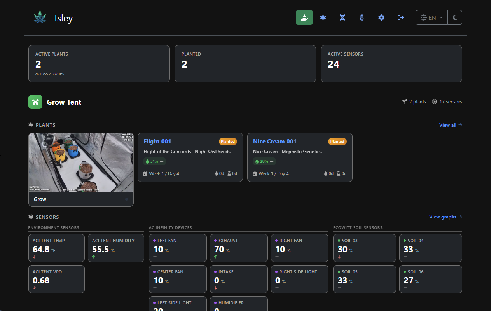

<div align="center">

# 🌱 Isley

### Self-Hosted Cannabis Grow Journal

*Track, trend, and elevate your grow — all in one place.*

[](https://hub.docker.com/r/dwot/isley)
[](https://golang.org)
[](LICENSE)
[](https://github.com/dwot/isley/issues)

[🌐 Official Site](https://dwot.github.io/isley) · [🐛 Report a Bug](https://github.com/dwot/isley/issues) · [💡 Request a Feature](https://github.com/dwot/isley/issues)

---



</div>

---

## Why Isley?

I built Isley because the tool I wanted didn't exist. Every existing option was either a phone app with a bad UX, a cloud service I didn't trust, or a spreadsheet held together with duct tape. I wanted **one self-hosted solution** to replace all three:

| Before Isley | With Isley |
|---|---|
| 🌡️ Vendor apps for sensor graphs | Unified environmental dashboard |
| 📝 Spreadsheets for seeds & harvests | Structured grow journal with charts |
| 🗒️ Notepads for feeding & watering history | Timestamped activity logs per plant |

Isley doesn't try to revolutionize your grow — it centralizes your tools so you can focus on what matters.

---

## 🚀 Key Features

| | Feature | Description |
|---|---|---|
| 📒 | **Grow Logs** | Track plant growth, watering, and feeding with custom activity types |
| 🌡️ | **Environmental Monitoring** | Real-time sensor data from AC Infinity and EcoWitt, plus custom HTTP ingest |
| 📸 | **Image Uploads** | Attach photos with captions; add text overlays and watermarks |
| 📷 | **Webcam Integration** | Capture periodic snapshots from camera streams via FFmpeg |
| 🌱 | **Seed Inventory** | Manage strains, breeders, and seed stock with Indica/Sativa and autoflower tracking |
| 📊 | **Harvest Tracking** | Record harvest dates, yields, and full cycle times |
| 📈 | **Graphs and Charts** | Visualize sensor data over time with configurable retention windows |
| ⚙️ | **Customizable Settings** | Define custom zones, activities, metrics, and camera streams |
| 🌍 | **Internationalization** | Available in English, German, Spanish, and French |
| 🔓 | **Guest Mode** | Optional read-only access for unauthenticated visitors |
| 💾 | **Backup & Restore** | Cross-database portable backups with optional image bundling and sensor data filtering |
| 📱 | **Mobile-Friendly** | Responsive layout for desktop and mobile |

---

## 🛠️ Coming Soon

- **🔔 Alerts and Notifications** — Set custom thresholds and get notified when conditions go out of range.

---

## ⚡ Quick Start

Isley runs in **Docker** and is up in minutes. PostgreSQL is recommended for production; SQLite works great for local testing.

> **Prerequisites:** [Docker](https://docs.docker.com/get-docker/) and [docker-compose](https://docs.docker.com/compose/install/)

### 🐳 Option 1: PostgreSQL (Recommended)

```yaml
# docker-compose.postgres.yml
version: '3.8'

services:
  isley:
    image: dwot/isley:latest
    ports:
      - "8080:8080"
    environment:
      - ISLEY_PORT=8080
      - ISLEY_DB_DRIVER=postgres
      - ISLEY_DB_HOST=postgres
      - ISLEY_DB_PORT=5432
      - ISLEY_DB_USER=isley
      - ISLEY_DB_PASSWORD=supersecret
      - ISLEY_DB_NAME=isleydb
      - ISLEY_SESSION_SECRET=change-me-to-a-long-random-string
    depends_on:
      - postgres
    volumes:
      - isley-uploads:/app/uploads
    restart: unless-stopped

  postgres:
    image: postgres:16.8-alpine
    environment:
      - POSTGRES_DB=isleydb
      - POSTGRES_USER=isley
      - POSTGRES_PASSWORD=supersecret
    volumes:
      - postgres-data:/var/lib/postgresql/data
    restart: unless-stopped

volumes:
  postgres-data:
  isley-uploads:
```

```bash
docker-compose -f docker-compose.postgres.yml up -d
```

Then open `http://localhost:8080` — default login is `admin` / `isley`. You'll be prompted to change your password on first login.

---

### ⚪ Option 2: SQLite (Lightweight / Local)

```yaml
# docker-compose.sqlite.yml
version: '3.8'

services:
  isley:
    image: dwot/isley:latest
    ports:
      - "8080:8080"
    environment:
      - ISLEY_PORT=8080
      - ISLEY_DB_DRIVER=sqlite
    volumes:
      - isley-db:/app/data
      - isley-uploads:/app/uploads
    restart: unless-stopped

volumes:
  isley-db:
  isley-uploads:
```

```bash
docker-compose -f docker-compose.sqlite.yml up -d
```

> **Note:** SQLite is not recommended for production due to write contention under concurrent load.

---

### 🔄 Migrating from SQLite to PostgreSQL

Already running Isley with SQLite? Isley handles the migration automatically.

Use `docker-compose.migration.yml` — it mounts both your existing SQLite volume and the new PostgreSQL instance. On startup, **if Isley finds existing SQLite data and an empty PostgreSQL instance, it will import everything automatically**.

```yaml
# docker-compose.migration.yml
version: '3.8'

services:
  isley:
    image: dwot/isley:latest
    ports:
      - "8080:8080"
    environment:
      - ISLEY_PORT=8080
      - ISLEY_DB_DRIVER=postgres
      - ISLEY_DB_HOST=postgres
      - ISLEY_DB_PORT=5432
      - ISLEY_DB_USER=isley
      - ISLEY_DB_PASSWORD=supersecret
      - ISLEY_DB_NAME=isleydb
    depends_on:
      - postgres
    volumes:
      - isley-db:/app/data
      - isley-uploads:/app/uploads
    restart: unless-stopped

  postgres:
    image: postgres:16.8-alpine
    environment:
      - POSTGRES_DB=isleydb
      - POSTGRES_USER=isley
      - POSTGRES_PASSWORD=supersecret
    volumes:
      - postgres-data:/var/lib/postgresql/data
    restart: unless-stopped

volumes:
  isley-db:
  postgres-data:
  isley-uploads:
```

> **Tip:** Back up your `isley-db` volume before running migration, just in case.

After migration completes, switch back to `docker-compose.postgres.yml` for your regular deployment.

---

## ⚙️ Configuration

Most settings are managed through the **Settings** panel in the app — enable integrations, set device IPs, scan for sensors, and more.

For environment-level configuration, the full reference is below:

### General

| Variable | Default | Description |
|---|---|---|
| `ISLEY_PORT` | `8080` | Port Isley listens on |
| `ISLEY_SESSION_SECRET` | *(random)* | Session encryption key (must be ≥32 bytes) — **set this in production** |
| `ISLEY_SECURE_COOKIES` | `false` | Set to `true` to mark session cookies as `Secure` (cookies only sent over HTTPS). Enable when Isley is fronted by a TLS reverse proxy. |
| `GIN_MODE` | `release` | Set to `debug` for verbose request logging and error details during development |

### Database

| Variable | Default | Description |
|---|---|---|
| `ISLEY_DB_DRIVER` | `sqlite` | Database backend: `sqlite` or `postgres` |
| `ISLEY_DB_FILE` | `data/isley.db` | SQLite database path |
| `ISLEY_DB_HOST` | — | PostgreSQL host |
| `ISLEY_DB_PORT` | `5432` | PostgreSQL port |
| `ISLEY_DB_USER` | — | PostgreSQL username |
| `ISLEY_DB_PASSWORD` | — | PostgreSQL password |
| `ISLEY_DB_NAME` | — | PostgreSQL database name |
| `ISLEY_DB_SSLMODE` | `disable` | PostgreSQL SSL mode — set to `require` (or `verify-full`) when connecting to a TLS-enforcing Postgres host |

---

## 🔌 API & Integrations

Isley exposes an HTTP API for pushing sensor data from custom devices, IoT hardware, or home automation systems.

### Generating an API Key

1. Log in as an admin and go to **Settings → API Settings**.
2. Click **Generate New Key** and copy it somewhere safe.
3. Include the key as an `X-API-KEY` header on all API requests.

### Ingest Endpoint

**`POST /api/sensors/ingest`**

```json
{
  "source": "custom",
  "device": "Arduino Sensor",
  "type": "temperature",
  "value": 25.5,
  "name": "Temperature Sensor 1",
  "new_zone": "Tent 1",
  "unit": "°C"
}
```

> **Use this for:** Arduino/ESP32 sensors, Home Assistant, Node-RED, or any off-the-shelf sensor not natively supported by Isley.

### Overlay Endpoint

**`GET /api/overlay`** — Returns a JSON snapshot of all living plants (with linked sensor readings) and grouped sensor data. Designed for live-stream overlays (e.g., OBS browser sources).

Requires the `X-API-KEY` header.

**Response structure:**

```json
{
  "plants": [
    {
      "id": 1,
      "name": "White Widow #3",
      "strain_name": "White Widow",
      "zone_name": "Tent A",
      "status": "Flower",
      "current_day": 42,
      "linked_sensors": [
        {
          "name": "Tent A Temp",
          "value": 24.5,
          "unit": "°C",
          "trend": "up",
          "source": "ACI",
          "type": "temperature"
        }
      ]
    }
  ],
  "sensors": { }
}
```

The `sensors` object groups all sensors by source, zone, and type with their latest readings.

### Sensor Data Endpoint

**`GET /sensorData`** — Returns historical sensor readings for charting. Requires authentication unless guest mode is enabled.

**Query parameters:**

| Parameter | Required | Description |
|---|---|---|
| `sensor` | Yes | Sensor ID |
| `minutes` | One of `minutes` or `start`/`end` | Number of minutes of history to return |
| `start` | One of `minutes` or `start`/`end` | Start date (`YYYY-MM-DD` or RFC 3339) |
| `end` | One of `minutes` or `start`/`end` | End date (`YYYY-MM-DD` or RFC 3339) |

**Example:**

```
GET /sensorData?sensor=5&minutes=1440
```

Returns an array of `{ "id", "sensor_id", "sensor_name", "value", "create_dt" }` objects.

---

## 🌡️ Sensor Integration

Isley supports two sensor platforms out of the box, plus a generic HTTP ingest API for custom hardware.

### AC Infinity

AC Infinity controllers (UIS series) expose temperature, humidity, and per-port speed data. Isley communicates with the AC Infinity cloud API — your controller must be online and linked to an AC Infinity account.

**Setup:**

1. Go to **Settings** and enable **AC Infinity Sensor Monitoring**.
2. Click **Retrieve Token** and enter your AC Infinity account email and password. Isley authenticates once and stores the API token locally — your password is not saved.
3. After the token is set, go to **Sensors** and click **Scan and Add AC Infinity Sensors**. Isley will discover all controllers and their sensor channels.
4. Assign each sensor to a **Zone** and toggle visibility for sensors you want to display.

Sensor data is polled at the interval configured in **Settings → Polling Interval** (default 60 seconds). Data appears on the dashboard and can be linked to individual plants for per-plant environmental monitoring.

> **Note:** AC Infinity's API limits password length to 25 characters. If your password is longer, only the first 25 characters are used during authentication.

### EcoWitt

EcoWitt weather stations and soil sensors expose data over a local HTTP API on your network. No cloud account is required — Isley communicates directly with the EcoWitt hub.

**Setup:**

1. Ensure your EcoWitt hub (e.g., GW1000, GW1100, GW2000) is on the same network as your Isley instance.
2. Go to **Settings** and enable **EcoWitt Sensor Monitoring**.
3. Go to **Sensors** and click **Scan and Add EcoWitt Sensors**. Enter the IP address of your EcoWitt hub (e.g., `192.168.1.50`) and click **Scan**.
4. Isley will discover soil moisture and indoor temperature/humidity channels. Assign zones and set visibility as needed.

EcoWitt data is polled at the same **Polling Interval** as AC Infinity. Multiple EcoWitt hubs are supported — scan each one individually.

### Custom Sensors (API Ingest)

For hardware not natively supported (Arduino, ESP32, Home Assistant, etc.), use the HTTP ingest endpoint documented in the [API & Integrations](#-api--integrations) section above. Any device that can make an HTTP POST can push sensor data into Isley.

---

## 💾 Backup & Restore

Isley stores data in two Docker volumes that should be backed up regularly.

| Volume | Contents | Path inside container |
|---|---|---|
| `postgres-data` (or `isley-db` for SQLite) | Database — all plants, sensors, settings, and history | `/var/lib/postgresql/data` (Postgres) or `/app/data` (SQLite) |
| `isley-uploads` | Plant photos, stream snapshots, and logo images | `/app/uploads` |

### Backing up

**PostgreSQL:**

```bash
# Dump the database to a SQL file
docker exec isley-postgres-1 pg_dump -U isley isleydb > isley_backup_$(date +%Y%m%d).sql

# Back up the uploads volume
docker cp isley-isley-1:/app/uploads ./isley_uploads_backup
```

**SQLite:**

```bash
# Copy the database file (stop the container first to avoid corruption)
docker compose -f docker-compose.sqlite.yml stop
docker cp isley-isley-1:/app/data ./isley_data_backup
docker cp isley-isley-1:/app/uploads ./isley_uploads_backup
docker compose -f docker-compose.sqlite.yml start
```

### Restoring

**PostgreSQL:**

```bash
# Restore the database from a SQL dump
cat isley_backup_20260315.sql | docker exec -i isley-postgres-1 psql -U isley isleydb

# Restore uploads
docker cp ./isley_uploads_backup/. isley-isley-1:/app/uploads
```

**SQLite:**

```bash
docker compose -f docker-compose.sqlite.yml stop
docker cp ./isley_data_backup/. isley-isley-1:/app/data
docker cp ./isley_uploads_backup/. isley-isley-1:/app/uploads
docker compose -f docker-compose.sqlite.yml start
```

> **Tip:** Automate backups with a cron job. For PostgreSQL, `pg_dump` can run while the database is online with no downtime.

### Built-in Backup & Restore

Isley includes a built-in backup system accessible from the **Settings > Backup** tab. It produces portable `.zip` archives that work across database backends — you can back up a SQLite instance and restore it onto PostgreSQL, or vice versa.

#### Creating a backup

Navigate to **Settings > Backup** and choose your options before clicking **Create Backup**:

| Option | Values | Effect |
|---|---|---|
| **Sensor History** | All, Last 7/30/90 days, None | Controls how much sensor data is included. Excluding sensor data keeps backups small and fast. |
| **Include Images** | On / Off | Bundles uploaded plant photos and stream snapshots into the archive. Can significantly increase backup size. |

Backups run asynchronously — you can navigate away and return later. Completed archives appear in the **Available Backups** table for download or deletion.

#### What's included

A backup archive contains a `backup.json` file with a full export of all application data (plants, strains, breeders, zones, activities, metrics, sensors, sensor readings, status history, measurements, images metadata, and streams), plus an optional `uploads/` directory with image files. The manifest records the Isley version, source database driver, creation timestamp, and the options used.

#### Restoring a backup

Upload a `.zip` archive in the **Restore Backup** section. The restore process replaces all existing data and runs through several phases: clearing existing tables, inserting data, resetting sequences (PostgreSQL), and extracting image files. A progress indicator shows the current phase and table-level progress throughout.

For SQLite users, a **Skip sensor data** option is available to dramatically speed up imports when sensor history isn't needed.

> **Warning:** Restoring a backup is destructive — it replaces all data in the current instance. Sensor polling is paused automatically during the restore.

#### Cross-database portability

Backups are stored as JSON, not SQL, so they are database-agnostic. A backup created on SQLite can be restored onto PostgreSQL and vice versa. Foreign keys, auto-increment sequences, and driver-specific optimizations are handled automatically during restore.

#### SQLite file transfer

SQLite users have an additional option under **SQLite File Transfer**: download or upload the raw `.db` database file directly. This is the fastest way to clone or migrate a SQLite instance since it bypasses row-by-row import entirely. The uploaded file is validated by checking the SQLite magic header before replacing the active database.

#### Upload size limits

The maximum upload size defaults to **5 GB** and applies to both backup archive uploads and SQLite file uploads. It also caps the total bytes extracted from a backup archive to defend against decompression bombs. You can adjust this limit in the **Restore Backup** section of Settings — the minimum is 100 MB.

#### Limitations

- **Full backups only** — every backup is a complete export; incremental or delta backups are not supported.
- **SQLite restore performance** — importing large sensor datasets into SQLite is significantly slower than PostgreSQL due to SQLite's single-writer architecture. Use the **Skip sensor data** toggle or the **SQLite File Transfer** feature for faster restores.
- **Memory usage** — backup archives are read into memory during restore. Very large backups (multi-GB with images) will temporarily consume a corresponding amount of RAM.
- **No scheduled backups** — backups must be triggered manually from the UI or API. For automated backups, use the Docker volume approach described above or call the `POST /settings/backup/create` endpoint from a cron job.

---

## 🔒 Reverse Proxy Examples

Running Isley behind a reverse proxy is recommended for production. This enables HTTPS, custom domain routing, and keeps Isley off a public port.

### Nginx

```nginx
server {
    listen 443 ssl;
    server_name isley.example.com;

    ssl_certificate     /etc/letsencrypt/live/isley.example.com/fullchain.pem;
    ssl_certificate_key /etc/letsencrypt/live/isley.example.com/privkey.pem;

    client_max_body_size 20M;  # allow image uploads

    location / {
        proxy_pass http://127.0.0.1:8080;
        proxy_set_header Host $host;
        proxy_set_header X-Real-IP $remote_addr;
        proxy_set_header X-Forwarded-For $proxy_add_x_forwarded_for;
        proxy_set_header X-Forwarded-Proto $scheme;
    }
}

server {
    listen 80;
    server_name isley.example.com;
    return 301 https://$host$request_uri;
}
```

### Traefik (Docker labels)

Add these labels to the `isley` service in your compose file:

```yaml
services:
  isley:
    # ... existing config ...
    labels:
      - "traefik.enable=true"
      - "traefik.http.routers.isley.rule=Host(`isley.example.com`)"
      - "traefik.http.routers.isley.entrypoints=websecure"
      - "traefik.http.routers.isley.tls.certresolver=letsencrypt"
      - "traefik.http.services.isley.loadbalancer.server.port=8080"
```

> **Note:** Isley ships with trusted proxy configuration for private RFC-1918 ranges, so `X-Forwarded-For` headers from your reverse proxy will be used correctly for rate limiting and logging.

---

## 🛡️ Production Recommendations

- Use **Docker with PostgreSQL** behind a reverse proxy (Nginx, Traefik) for TLS termination and clean URL routing.
- Back up these volumes on a regular schedule — see [Backup & Restore](#-backup--restore) above.
- Set `ISLEY_SESSION_SECRET` to keep sessions valid across container restarts.
- Configure a [sensor data retention period](#) in Settings to prevent unbounded database growth.

---

## 📝 Notes

- Isley is in **active development** 🚧 — breaking changes may occasionally occur between releases.
- Found a bug or have a feature request? [Open an issue](https://github.com/dwot/isley/issues) — contributions welcome.

🌐 For screenshots, feature highlights, and the latest news: [dwot.github.io/isley](https://dwot.github.io/isley)

---

## ⭐ Star History

<a href="https://www.star-history.com/?repos=dwot%2Fisley&type=date&legend=top-left">
 <picture>
   <source media="(prefers-color-scheme: dark)" srcset="https://api.star-history.com/svg?repos=dwot/isley&type=Date&theme=dark&legend=top-left#gh-dark-mode-only" />
    <source media="(prefers-color-scheme: light)" srcset="https://api.star-history.com/svg?repos=dwot/isley&type=Date&legend=top-left#gh-light-mode-only" />
    
 </picture>
</a>